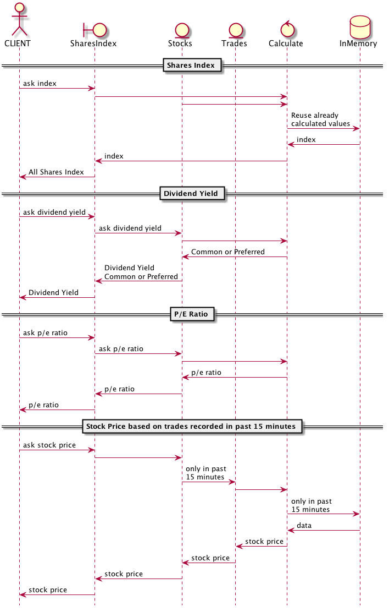

# Super Simple Stocks 

JPMorgan Super Simple Stocks Assignment for a fake Global Beverage Corporation Exchange. Further details at [Assigment PDF](SuperSimpleStocks.pdf).


<!-- java -jar /opt/plantuml/plantuml.jar README.md -o images -->
<!--
@startuml summary.png

hide footbox

actor CLIENT 
boundary SharesIndex
entity Stocks
entity Trades
control Calculate 
database InMemory 

CLIENT -> SharesIndex : ask calculation 
SharesIndex -> CLIENT : All Shares Index 

@enduml
-->

## Approach and simplifications

The main approach for this assigment was to make it easier to test and to keep an eye in possible optimizations. Being Super Simple Stocks a toy app, some of the following approaches are overkilling:

* Avoid to calculate expensive methods by reusing valid data.

  Being **pow** function expensive at **Geometric Mean** and supposed that **All Share Index** method will be invoked more offen than changes among all the prices needed to calculate it, make sense to tackle one approach of reusing even intermidary values. 

  So only that *Geometric Mean* will be recalculated when prices suffer changes. Furthermore, intermedary values for *pow* calls on **prices** will be reused if possible.

* Avoid complex *OOP* in favor of simple schemas.  

  Instead of dealing with **virtual tables of pointers* and associated hierarchy utilities, a humble 'if' might do the trick for *Common vs Preferred xtocks* selections on **Dividend Yield**. 

  So we trade memory in order to spare costly indirection through pointers. Of course, without a serious measurement on the real app we don't know if that extra bloat code can provoke cache misses and worse the scenario.

* Use (and abuse) of *inlining* code.

  Previous approaches are easier tackle when the code is **local**. As well inlining in C++ implies to keep declaration and defenition close, leading to almost *auto sufficient* header files.

  So our code can be unit tested easier when it's just a set of *headers* file. In the real world, they will be more complex binaries, supposely **libraries**.

* Unified generation framework.

  An attempt was made to just use the generation *CMake* tool to **build, test, package and even document** the application.  Pending **Doxygen** documentation and its conversion into **PDF** or **HTML** documentation.

  So documentation is mainly based on **markdown** README at this stage.

## Requirements

This project is based on **C++14** standard (g++ >= 5.2, clang++ >= 3.8, apple clang++ >= 7.0), latest **boost** libraries (>=1.58) and expected as well a modern *cmake* (>=3.5). 

Hence, if you work on an updated develop environment, i.e, *Debian sid*, you are supposed to get by default the correct versions:

       rm -rf build && mkdir build && cd build && cmake ..
       
But if you're working on a more stale but robust box, i.e. *RedHat 7*, don't forget to launch **cmake** with enough information to get to latest compilers/libraries (provided specifically compiled boost libraries at /opt/gcc/boost):

       rm -rf build && mkdir build && cd build && \
       cmake -DBOOST_ROOT=/opt/gcc/boost -DCMAKE_CXX_COMPILER=/opt/gcc/bin/g++ ..

If you happen to compile a specific version of **boost** libraries for a *clang* compiler, but remember that they could depend on *libc++* and *libc++abi* when you deploy on a vanilla box. Hence a forced *RUN_PATH* compilation (rpath) will take place to hardcode libc++ & libc++abi path to */opt/clang/lib*:

       rm -rf build && mkdir build && cd build && \
       cmake -DBOOST_ROOT=/opt/clang/boost -DCMAKE_CXX_COMPILER=/opt/clang/bin/clang++ ..

Something similar if you work on *OSX* (provided Homebrew installed boost libraries at /usr/local/Cellar/boost/1.60.0_1). In this case no need to worry about *llvm/libc++*; on **Apple** platfomrs is the stardard choice (it seems that Google Android & Windows are following that path as well):

       bash -c "rm -rf build && mkdir build && cd build && \
       cmake -DBOOST_ROOT=/usr/local/Cellar/boost/1.60.0_1 \
             -DCMAKE_CXX_COMPILER=/usr/bin/clang++ .."

**Note:** Default flags are defined to statically link as much as possible depending on different systems in order not to require latest development compilers/libraries on deployment machines:

       set(CMAKE_CXX_FLAGS "-std=c++14 -Wall -Wno-unused-local-typedefs -static-libstdc++ -static-libgcc -g")
       set(Boost_USE_STATIC_LIBS ON CACHE BOOL "use static libraries from Boost")
       set(Boost_USE_STATIC_RUNTIME ON CACHE BOOL "use static runtime from Boost")       

**Note:** Remember you can ask for help to *make* command to know which targets there are available:

```
make help

The following are some of the valid targets for this Makefile:
... all (the default if no target is provided)
... clean
... depend
... package
... edit_cache
... rebuild_cache
... package_source
... test
... install/local
... list_install_components
... install
... install/strip
... SuperSimpleStocks
... unitTest
```

## Test

Unit test could be executed by running **make test** or **unitTest**. See further details at [Test](test/README.md)

## Install

Binaries and libraries can be installed by running **make install**. Maybe it could be required *root* permissions depending on where they want to be installed into.

## Packaging

Basic packaging, i.e. tarred binaries & libraries, can be generated by running **make package**.

## Documentation

The previous diagrams were generated directly from README **markdown** files thanks to [PlantUML](http://plantuml.com) with the following command:

      java -jar /opt/plantuml/plantuml.jar README.md -o images

In the same way, you can embed your diagrams inside of the code itself and complement them with *Doxygen/Latex/Graphviz/Plantuml* tools. It's always possible to ignore document generation by not invoking **make doc** or **make image** optional targets in future updated *CMakefile/Makefile* files. Documentation might be generated on your building directory by running **make doc** or generated & deployed by running **make install_doc**. 

If only documentation happens to be required, it's possible just to generete & deploy it on your desired location, i.e. a local **NGINX** server, withthe following options:

       rm -rf build && mkdir build && cd build && \
       cmake -DJUST_DOCUMENTATION=True -DPDF_FILE=/usr/share/nginx/html/example.pdf \
       -DHTML_DIR=/usr/share/nginx/html/example .. && make install_doc

See further details at [External Project](https://github.com/xue2sheng/minitasks/blob/develop/README.md) if you're interested in adding that support.

## Example

Compiling & executing a mock apps and unit tests with the following command on a **MacBookPro** with its default *Apple clang++** compiler. On macOS you can choose to work with its **Homebrew** *g++-6* compiler but don't forget to point to the correct version of *boost* libraries (differentc compilers mean usually different **boost** libarries location).

        bash -c "rm -rf build && mkdir build && cd build && \
        cmake .. && make && make install && \
        /usr/local/SuperSimpleStocks &&  /usr/local/unitTest --log_level=message"

Your output should be similar to:

```'
-- The CXX compiler identification is AppleClang 7.3.0.7030031
-- Check for working CXX compiler: /Applications/Xcode.app/Contents/Developer/Toolchains/XcodeDefault.xctoolchain/usr/bin/c++
-- Check for working CXX compiler: /Applications/Xcode.app/Contents/Developer/Toolchains/XcodeDefault.xctoolchain/usr/bin/c++ -- works
-- Detecting CXX compiler ABI info
-- Detecting CXX compiler ABI info - done
-- Detecting CXX compile features
-- Detecting CXX compile features - done
-- VERSION_INFO: git@github.com:xue2sheng/SuperSimpleStocks.git master 067c08b [Thu Aug  4 22:29:00 IST 2016] user@MacBookPro.local
-- DOXYFILE_PROJECT_NUMBER: 0.0.1_067c08b
-- Boost version: 1.60.0
-- Apple Clang FLAGS: -std=c++14 -Wall -Wno-unused-local-typedefs -Wno-deprecated-declarations -stdlib=libc++ -g
-- Boost version: 1.60.0
-- Found the following Boost libraries:
--   unit_test_framework
-- Configuring done
-- Generating done
-- Build files have been written to: /Users/user/Code/JPMorgan/SuperSimpleStocks/build
Scanning dependencies of target SuperSimpleStocks
[ 25%] Building CXX object src/CMakeFiles/SuperSimpleStocks.dir/main.cpp.o
[ 50%] Linking CXX executable SuperSimpleStocks
[ 50%] Built target SuperSimpleStocks
Scanning dependencies of target unitTest
[ 75%] Building CXX object test/CMakeFiles/unitTest.dir/testMain.cpp.o
[100%] Linking CXX executable unitTest
[100%] Built target unitTest
[ 50%] Built target SuperSimpleStocks
[100%] Built target unitTest
Install the project...
-- Install configuration: ""
-- Installing: /usr/local/SuperSimpleStocks
-- Installing: /usr/local/unitTest

Thu Aug  4 22:29:05 2016
 GBCE All Share Index = 156.412
Thu Aug  4 22:29:05 2016
 GBCE All Share Index = 152.339
Thu Aug  4 22:29:06 2016
 GBCE All Share Index = 146.417
Thu Aug  4 22:29:06 2016
 GBCE All Share Index = 156.761
Thu Aug  4 22:29:07 2016
 GBCE All Share Index = 108.91

ALE: Common, last_dividend = 23, par_value = 60, fixed_dividend = 0, price = 171.978, dividend yield = 0.133738, P/E ratio = 7.4773, number of trades = 10, stock price = 171.978
GIN: Preferred, last_dividend = 8, par_value = 100, fixed_dividend = 0.02, price = 156.408, dividend yield = 0.0127871, P/E ratio = 19.551, number of trades = 10, stock price = 156.408
JOE: Common, last_dividend = 13, par_value = 250, fixed_dividend = 0, price = 158.761, dividend yield = 0.0818841, P/E ratio = 12.2124, number of trades = 10, stock price = 158.761
POP: Common, last_dividend = 8, par_value = 100, fixed_dividend = 0, price = 185.686, dividend yield = 0.0430834, P/E ratio = 23.2108, number of trades = 10, stock price = 185.686
TEA: Common, last_dividend = 0, par_value = 100, fixed_dividend = 0, price = 19.3232, dividend yield = 0, P/E ratio = inf, number of trades = 10, stock price = 19.3232

Running 4 test cases...

Several test cases at Thu Aug  4 22:29:07 2016
VERSION_INFO: git@github.com:xue2sheng/SuperSimpleStocks.git master 067c08b [Thu Aug  4 22:29:00 IST 2016] user@MacBookPro.local

Tests on 'Trade' class
   Insert a value
   Clear all values
   Insert 10 values, one each 500 msec
   Check out stock price formula
   Clear only ald trades

Tests on 'Stock' class
   Create Common Stock
   Check common dividend yield formula
   Create Preferred Stock
   Check preferred dividend yield formula
   Create Stock with positive dividend
   Check P/E Ratio formula
   Create Stock with zero dividend
   Check P/E Ratio formula now is infinity 

Tests on 'GBCE' class
   Create 'Global Beverage Corporation Exchange' class 
   Check GDCE All Share Index formula

*** No errors detected
```
